# Distraction free desktop workspace for developers

Searching for and arranging windows momentarily interrupts the workflow and disrupts the continuity of your thoughts, therefore easily impeding the flow. Consequently, the comfort of the environment you use on a daily basis is important. The following article discusses organizing the workspace and enabling fast switching between windows and virtual desktops. Based on my experience, I have compiled Linux solutions that bring the convenience of Tmux, commonly found in terminal environments, to GUI desktop environments (such as XFCE, KDE, GNOME, etc.). Tiling window managers (AwesomeWM, Qtile, I3, etc.) are optional but highly useful components of the environment. The main goal of Rofi shell scripts is to create an easily usable, fast, and keyboard-driven workflow.

You can think of the windows in the desktop environment as different panels or views in an IDE, and like panels, windows perform different tasks. An IDE is convenient (among other reasons) because all the necessary tools for a task are in one place, and you know the position of each panel without thinking. So, if you can easily access your windows, then **your operating system itself can be as efficient as an integrated development environment** ("Unix as IDE").

The solutions listed below are inspirational, and you can choose from them according to your preference. Each of them is an optional plugin for your workflow.

## Terminal workflow

The need for switching between running processes and their spatial arrangement has already emerged in the terminal, which is why the frequently mentioned "split" solutions of GNU Screen and Tmux programs were created. Let's assume that you are not using a desktop environment, just a single terminal. If you open a text editor to edit a program's code and you want to view documentation for a specific command, you first have to hide (minimize) the text editor and bring it back to the foreground after reading the documentation because you don't have the ability to display the documentation and the code simultaneously (for the sake of clarity, we will disregard the capabilities of the text editor).

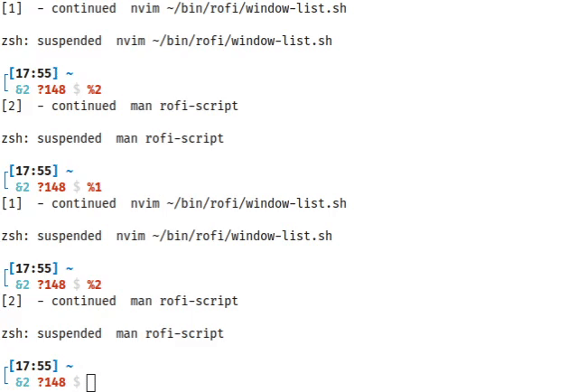

The "split" solution in Tmux helps with this by dividing the terminal into two sections, as if they were two glued windows, allowing you to see the subjects of your task side by side. Similarly, you can further divide the terminal into additional sections to open additional applications, but these applications partition the fixed-sized area into further subdivisions, ensuring they do not overlap and remain fully visible. However, as you open more applications, the area allocated to each application becomes smaller and smaller, eventually becoming too small to be usable, thus making the workspace uncomfortable despite the convenience provided by the "split" feature.

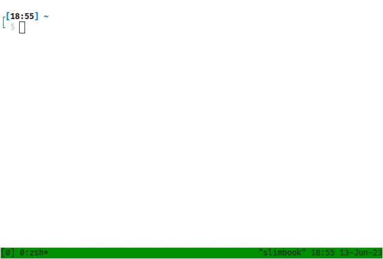

Users vary in how they use Tmux, but generally, these styles are popular and address this problem.

### Separate workspaces for each task

In Tmux, you can create additional workspaces, virtual desktops, so you can have a workspace, for example, where you see the code and documentation side by side, and another workspace where you have a database client and the database documentation open. This way, the programs are grouped logically according to their tasks. You can give names to the groups, and you can easily switch between them using a searchable list.

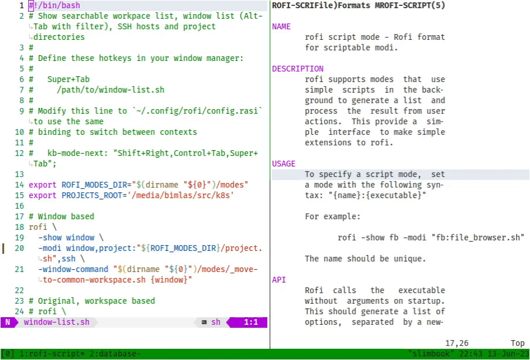

**The advantage of continuously decreasing size for newly opened applications is that the workspace itself forces you to make it more organized, thus demanding structured work.** Unnecessary open applications that only occupy space will be closed without request, and only what you actually use will remain on your workspace.

However, this solution has several disadvantages for me:

- If you need to open more and more applications for a task, you will once again have limited space, requiring you to create new workspaces. One possible solution is to group the workspaces by naming them (e.g., splitting the `fix-db-issue` workspace into `fix-db-issue_code` and `fix-db-issue_db-client`), but this is not efficient; clearly, it is a workaround.
- Based on the list of workspaces, you cannot see which applications are open in each workspace. For example, if my colleague requested a database query from me, I knew that I already had a pre-opened database client, but I couldn't remember which task it was related to or which workspace it appeared in. Although I could search among the workspace names textually, it would have been simpler to search for the name of the application itself, relying solely on text search. **The mixed use of spatial memory and textual search is not efficient.**

### Separate sessions for each task

In Tmux, workspaces are associated with a session, but you can create multiple sessions, which means you can keep tasks in separate sessions. The advantage of this approach is that you can see each application in full size on its own workspace, and you only use splits when you actually want to view applications side by side, such as comparing two documents. This is more convenient than constantly moving applications to another workspace due to decreasing sizes.

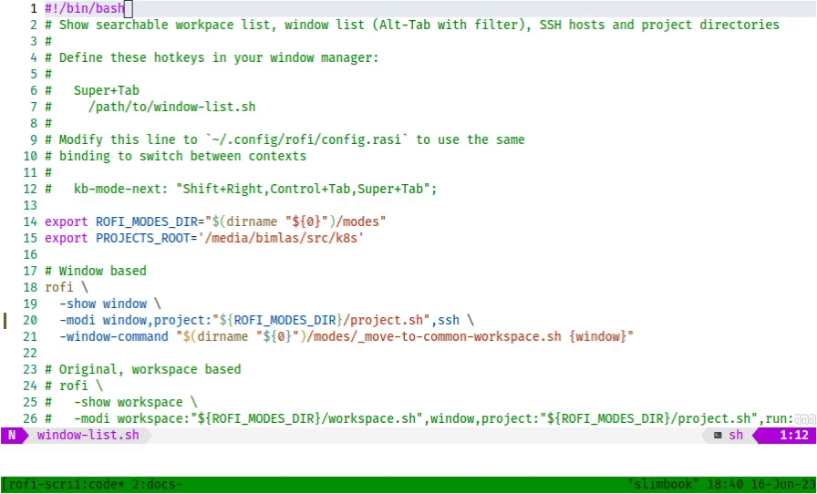

While the force that enforces organization is eliminated, it still feels more natural to **switch between views of applications, rather than tasks. So, only the applications you want to see together will be on the screen**, even if multiple applications are associated with the task you're working on.

### Single session for each task

The solution that appeals to me the most is to have everything within a single session, regardless of the task, and use window naming for grouping. This provides a more flexible structure compared to keeping windows in thematic silos. You can easily navigate between tasks without worrying about which session to place a temporary window in for a quick task. The split feature is still available to view two windows side by side if needed.

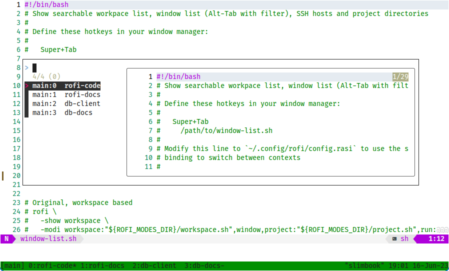

## Desktop environment workflow

The solutions provided by Tmux are highly efficient, and many individuals who primarily use terminal applications are satisfied with them and do not require anything more. However, the problem is that we often need to use not only terminal applications but also other types of applications. For example, certain documentation may only be viewable with a PDF reader, web browsers are graphical applications, and some people prefer using VSCode over Vim or Emacs.

In a desktop environment, alongside terminal applications, you can open GUI programs, which are often essential requirements nowadays. One advantage of windows compared to Tmux is that instead of using splits, you can open two separate, independent windows that can be freely moved within the available space. These windows can overlap, allowing you to arrange and resize them freely. This provides more flexibility and fewer restrictions, but it can also lead to a potentially chaotic desktop where things become less transparent.

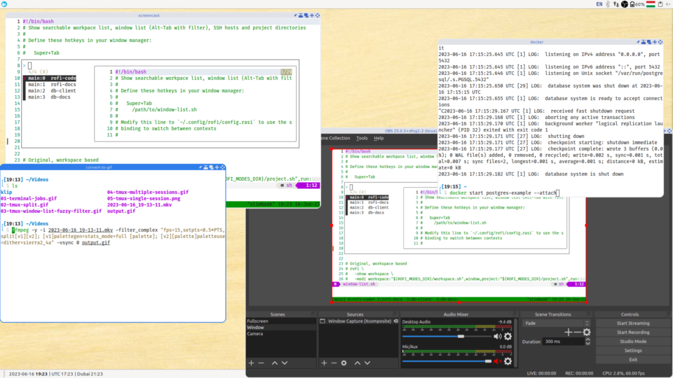

To make your desktop more organized, you can maximize the windows to full size. However, if your intention is to view two windows side by side, whenever you switch to a third window, you would need to bring the side-by-side windows to the foreground again. This is not a convenient solution as it requires additional effort to maintain the desired window arrangement.

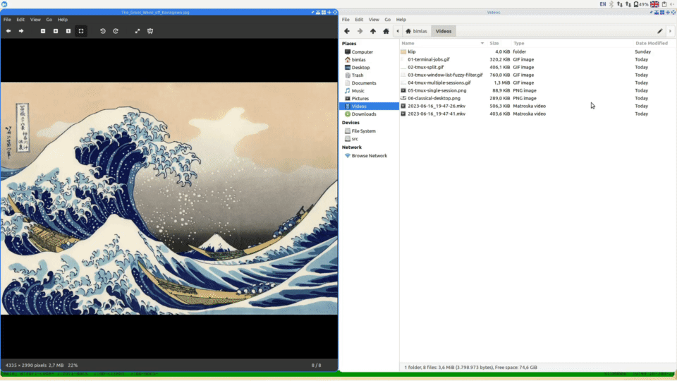

Although the desktop environment can handle workspaces, many people do not use them because they may find them cumbersome to use. However, if you do move the windows you want to see side by side to a separate workspace, you need to find a solution to see the list of all open windows in one place; otherwise, you would have to mentally keep track of which window is in which workspace.

Typically, we switch between windows based on a list of windows, whether through the desktop panel, a menu, or by pressing `Alt+Tab`. The problem with this approach is that you have to search through the list and go through each item, which can be time-consuming and stressful, especially when there are many open windows.

If a well-organized workflow can already be achieved in the terminal, what options do we have to make the desktop environment just as convenient?

### Window list filter

The most basic requirement that arises is to not have to go through the list of windows one by one, but to have a filterable list that allows you to easily switch between open applications. Rofi provides a solution for this, allowing you to **access all open applications from one place and filter them**. With Rofi, you can quickly find the desired window by typing a few letters, even if there are 26 other windows alongside it.

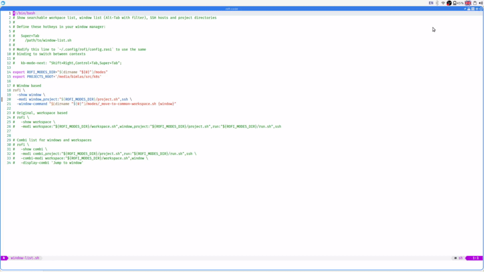

The advantage of this solution is that you can group your windows by moving them to different workspaces, yet still find them all in one central location.

### Separate browser windows instead of tabs

If you already have a filterable list of windows, there is no need to continue searching among the tabs within the browser. It is simpler to view each browser page in a separate window and search for the tab name in the window list. The creators of Chrome also recognized that it is easier to search for tabs textually (https://blog.google/products/chrome/search-your-tabs-bookmarks-and-history-in-the-chrome-address-bar/), but with a general window filtering feature, you can use this functionality with any browser. If you only want to search among the browser tabs and exclude other applications, start by filtering based on a partial match of the browser's name (e.g., for Chrome, use `chr`). You don't need to worry about resource consumption because having two separate browser windows requires only slightly more resources than having two tabs.

To open a link in a new tab, you need to click on it with the middle mouse button. If you want to open it in a new window, use the `Ctrl+Shift+LeftClick` combination. To open a new, empty tab, you can use the `Ctrl+T` combination, and for opening a new window, you can use `Ctrl+N`. There are browser extensions available that automatically open every link in a new window, but they don't always work with different Chromium-based browsers (Vivaldi, Brave, Edge, etc.), so I do not recommend them.

### Windows with names

To make the windows truly searchable, you need to know their names or at least some keyword that can narrow down the list of windows enough for you to easily identify them. Most applications use the title of the document or content within them as the window name, but this is not always straightforward. For example, if you are comparing a live version of a website with a version under development, both browser tabs may have the same title because the real difference lies in the URL. To make this information accessible, you can use a Userscript that appends the current domain name to the webpage title, so it will appear in the list of windows as well.

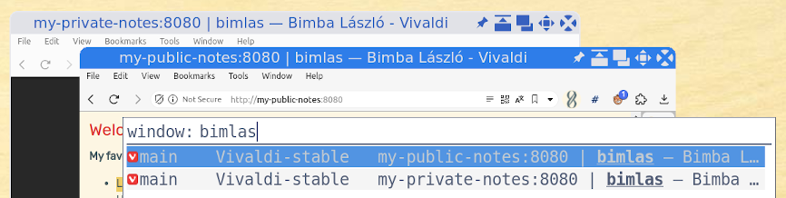

A similar problem exists with terminal applications where, even though the shell sets the title of the terminal window to include the name of the running application and the current path, it's not always sufficient for identification. To ensure that each opened terminal always has a distinctive title, you can create a shortcut that prompts you to provide a title before opening the terminal. This way, you can set a meaningful title that helps you easily identify the terminal window.

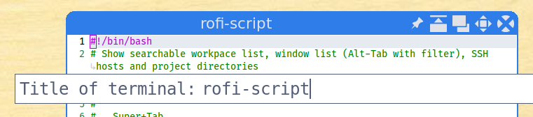

### Switch or launch project

If you already have a searchable window list that allows you to search among the opened windows, it would be great if you could launch the necessary application for your task if it's not already open. Even better, it would be ideal if it could open the entire project you want to work on instead of just the application. Luckily, Rofi is highly versatile and capable of doing this: if the entered text is not found in the list of opened windows, you can switch to the next Rofi mode, which contains projects and SSH hosts, and open them in the appropriate way.

This is one possible way to expand the functionality of Rofi and customize the management of opened windows and projects. The exact implementation will depend on the system you are using and how Rofi is configured on your system. The Rofi documentation and configuration files will help you customize the settings and extend the functionality.

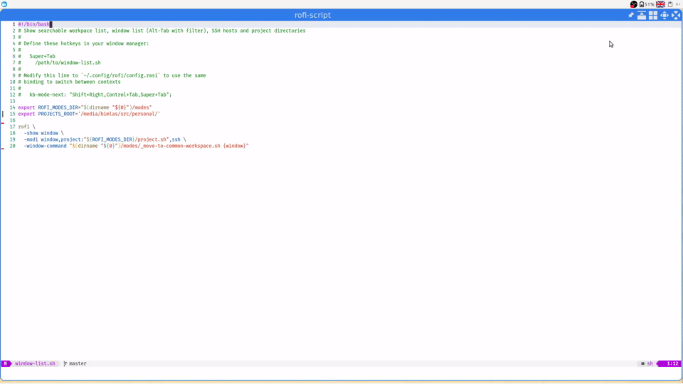

In addition to opening the project, it performs the necessary basic steps for your work (such as executing the `git pull` command, displaying the output of `git status`, etc.). Furthermore, since the project can be easily reopened, there's no need to keep it open if you no longer need it.

### Arrange windows, group windows to views

In addition to window switching, it would be great to manage the layout of windows, allowing you to easily move two windows to another workspace and display them side by side. **Dynamic tiling window managers implement window layouts similar to Tmux for GUI applications**, providing a similar workflow where windows are automatically resized when new applications are opened, similar to how Tmux behaves. However, **the real advantage of tiling window managers lies in their scriptability, allowing you to customize their behavior to suit your specific needs**. For example, you can easily resize the window headers to make them readable in a screencast.

To overcome the drawback of continuously decreasing window size in dynamic tiling, while still taking advantage of automatic window arrangement, you can write a script for the window list that groups windows with a button press. This approach allows you to achieve the desired window grouping and layout while utilizing the benefits of a dynamic tiling window manager. By scripting and customizing the behavior, you can tailor the window manager to your specific requirements.

Look at the desktop names in window list!

- By default, windows are maximized on the `main` workspace.
- Window grouping is done exclusively using the window list (no additional hotkey is required).
- The current window (file browser) is the "source" window.
- If you hover over a window in the list (image viewer) and press `Shift+Enter` instead of `Enter` for window switching, both the current window and the selected window are moved to a newly created workspace (`#1`) for simultaneous viewing (dynamic tiling).
- If you want to add an additional window (web browser) to the group, find any member of the group in the list and press `Shift+Enter` on it (thus, `Shift+Enter` means "grouping").
- To remove a window from the group (image viewer), move it back to the `main` group, where it will be maximized according to the workspace settings.
- When a group has fewer than 2 members (because you moved the web browser to the `main` group), the group is disbanded, and the last remaining member (file browser) is automatically moved to the `main` group.

Please note that these instructions assume a specific workflow and usage of window management. The actual implementation may require configuring your window manager or using a script to achieve the desired behavior.

The workspaces will actually be optional views rather than continuous parts of your workflow, but due to their ease of use, you will likely use them frequently. For example, you can easily move one element of a three-member group to a new group with a fourth application, and when you're done with your task, you can move it back to its original position in the three-member group.

You probably wouldn't want to replace your desktop environment just to have organized windows, but fortunately, it's not necessary because **tiling window managers can usually be easily integrated into existing desktop environments**. This means that your system remains the same, but the appearance of window borders and the behavior of windows are determined by the tiling window manager. For example, in Linux Mint XFCE Edition, there is a setting that allows you to easily switch between window managers with a single click (Desktop Settings).

During the writing of the article, I made an effort to ensure that my implementations could be used in any desktop environment and tried to avoid using tiling window managers. However, I simply couldn't find a way to achieve the desired functionality using tools like `wmctrl`, `xdotool`, and similar window manipulation applications. Tiling window managers have events, hooks and make it easy to create and modify workspaces, but **simpler command-line applications cannot handle windows at such an abstract level** because it's simply not their purpose to provide a comprehensive solution for every task. If I insisted on using these applications, I would have to implement the hook mechanism and other abstract solutions that tiling window managers already provide, which would complicate the goal of simplification.

## Scripts, implementation

You can find the implementation of the mentioned features in the following repository:

https://github.com/bimlas/howto-distraction-free-desktop-workspace-for-developers

Please star if you like it!

## Continue the list

These ideas can be applied in other areas as well. For example, if you consider Vim tabs as alternatives to workspaces and the buffer list as the equivalent of Rofi, you can create a similar workflow in Vim.

I hope this description has given you some ideas on how to make your everyday work more efficient and enjoyable. Please continue the list with your own ideas and share tips for yourself and others!

(PS.: The article was translated by AI)

